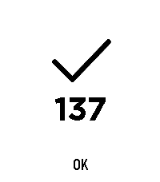

# EasyCount

Két Pebble/RePebble one-click watchapp egy közös forrásból. A két külön app
külön URL-t tárol, ezért a felső és az alsó Quick Launch gombhoz eltérő művelet
rendelhető.



## Letöltés

A telepíthető PBW-fájlok a
[legfrissebb GitHub Release-ben](https://github.com/szundi/easycount/releases/latest)
találhatók.

## Telefonos URL-beállítás

Mindkét app `configurable` képességű. A Pebble mobilappban az app melletti
fogaskerékkel nyisd meg a Settings oldalt, add meg az URL-t, majd nyomd meg a
`Mentés` gombot. Az oldal az appba csomagolt Clay felület, ezért nem kell hozzá
külső konfigurációs weboldal.

A két app külön UUID-t használ. Emiatt a felső és az alsó URL külön tárolódik a
telefonon.

A Settings megnyitásakor a telefon elindíthatja az óraalkalmazást. Ilyenkor az
app nem indít HTTP-kérést. A beállítóoldal bezárása után az óraalkalmazás is
kilép.

## Telefonos alkalmazáskép

A `store-assets/emery/result-137.png` a Pebble Time 2 Store-listinghez készült
képernyőkép. A PBW nem tud ilyen bemutatóképet beállítani a Pebble mobilappban;
azt külön kell feltölteni az alkalmazás Store-listingjéhez. A PBW-be ágyazott
`menuIcon` csak az óra launcherében jelenik meg.

## Működés

Az óra indításkor explicit üzenetet küld a telefonos komponensnek. Ez indítja el
a HTTP `GET` kérést. A Settings oldal megnyitása önmagában nem hívja meg az
URL-t.

- Várakozás közben egy nyolcpontos spinner forog.
- HTTP 200-299: pipa, a visszaadott szöveg, `OK`, rövid
  rezgés, majd kilépés.
- A válasz tetszőleges UTF-8 szöveg lehet. A javasolt fejléc:
  `Content-Type: text/plain; charset=utf-8`.
- A betűméret a szöveg hosszával csökken. A méretlépcsők: legfeljebb 4, 6, 10,
  16 és 24 karakter, majd a legkisebb méret. A kijelzőre nem férő szöveg vége
  ellipszist kap.
- A telefon legfeljebb 240 UTF-8 bájtot küld az órának. A hosszabb választ már
  a telefon ellipszissel rövidíti. A Pebble rendszerfontjából hiányzó Unicode
  karakterek nem jelennek meg helyesen.
- Más HTTP-státusz: X, a pontos HTTP-kód, hosszú rezgés, majd kilépés.
- Hálózati hiba vagy időtúllépés: X, `Hiba 0`, hosszú rezgés, majd kilépés.
- Hiányzó URL: X, `Hiba -1`, hosszú rezgés, majd kilépés.
- Ha a telefon nem válaszol, az óra 15 másodperc után `Hiba 0` eredménnyel
  kilép.

## Projektstruktúra

- `src/`: az egyetlen közös C- és PebbleKit JS-forrás.
- `resources/images/`: a két app 25x25 képpontos launcher ikonja.
- `artwork/`: az ikonok szerkeszthető forrásai.
- `variants/up/package.json`: a felső app neve és UUID-je.
- `variants/down/package.json`: az alsó app neve és UUID-je.
- `scripts/build-variant.sh`: ideiglenes build-projektből elkészíti a két PBW-t.

## Fordítás

```sh
uv tool install pebble-tool --python 3.13
pebble sdk install latest
npm install
make
```

Az elkészült csomagok:

- `dist/easycount-0.pbw`
- `dist/easycount-1.pbw`

Telepítsd mindkét csomagot. Ezután az órán rendeld az `easycount-0` appot az
alsó Quick Launch gombhoz, az `easycount-1` appot pedig a felső gombhoz.
